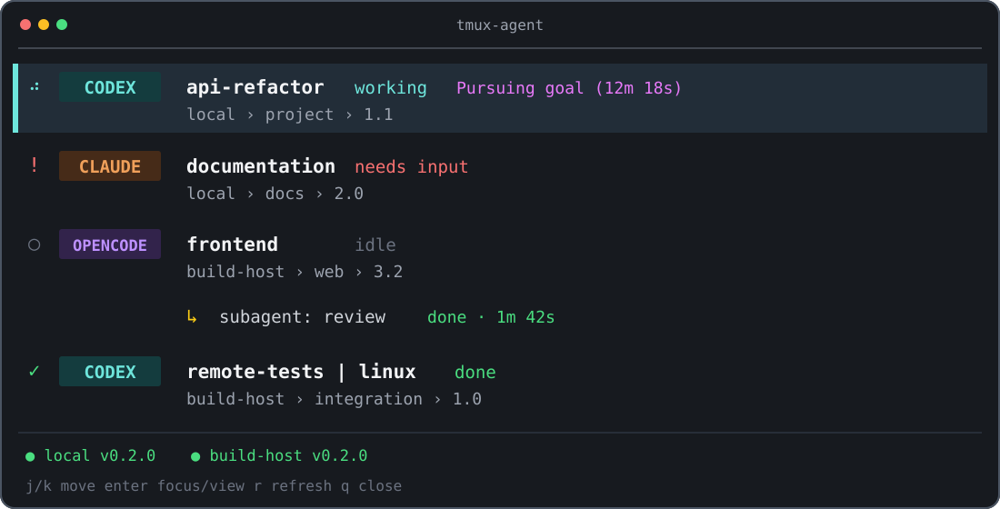
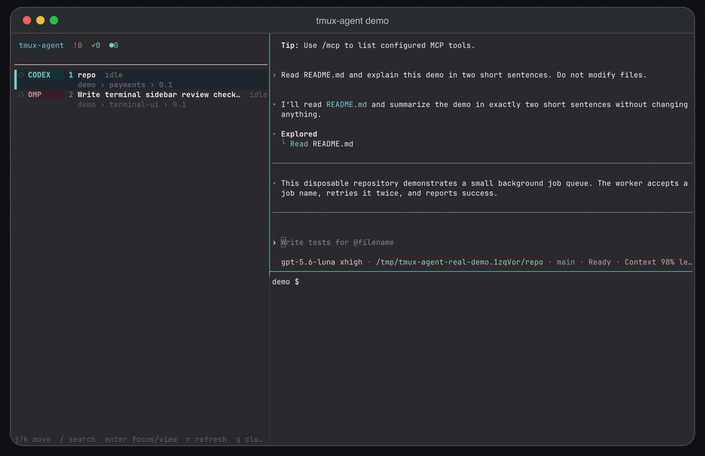

# tmux-agent

tmux-agent is a local-first activity view for coding agents running in tmux,
ordinary terminals, and explicitly configured SSH machines.



It shows which sessions are working, blocked, idle, or done and lets you jump
back to the exact tmux pane. Codex, Claude, OpenCode, Grok, OMP, and Pi have
project-owned typed detectors. Codex goal progress and nested subagents are
shown without forwarding the goal objective or rollout content in federation
snapshots.

> **Early release:** Real-world testing has focused primarily on Codex in local
> and SSH-based tmux workflows. Claude, OpenCode, Grok, OMP, and Pi are supported
> but have received less testing.

## See the workflow



The sidebar filters sessions as you type, focuses the selected agent with
`Enter`, and activates the first ten sessions directly with `1`-`9` and `0`.

## Install with TPM

Requirements:

- tmux 3.2 or newer on macOS or Linux
- TPM
- `curl` or `wget`, `tar`, and a SHA-256 tool

Add the plugin before the TPM `run` line in `~/.tmux.conf`:

```tmux
set -g @plugin 'hypertectonic/tmux-agent'
set -g @tmux-agent-key 'A'
```

Press `prefix + I`, then `prefix + A`. When no compatible managed binary is
installed, the plugin downloads the version recorded in `VERSION`, verifies
the checksum and binary version, starts one daemon for the selected tmux
server, and opens an 80 percent popup. A newer compatible managed binary is
kept in place.

The plugin does not create a sidebar, split, window, or session. A pane where
you run `tmux-agent ui` can be used as a user-managed sidebar.

For a standalone installation, run `scripts/install`. It publishes a stable,
versioned launcher at `~/.local/bin/tmux-agent`, keeps runtime and lifecycle
controller selections independent, and safely upgrades older official
launchers. Direct binaries are preserved during migration; a same-version
binary must exactly match the verified release.

See [Installation](docs/installation.md) for standalone installation, plugin
options, update, rollback, and uninstall instructions.

## Update and rollback

The packaged binary owns its lifecycle in both installation modes:

```sh
tmux-agent update
tmux-agent versions
tmux-agent rollback <version>
```

`tmux-agent update` installs a newer verified release, `versions` shows the
active and available recovery versions, and `rollback` selects an already
installed version. Normal release updates are user-initiated: tmux-agent does
not poll for releases, update on a schedule, or issue lifecycle commands on an
SSH peer.

For TPM installations, `prefix + U` updates the plugin checkout rather than
seeking the latest binary release. Loading that checkout may run its narrow
compatibility repair: when `current` is absent, below the checkout's floor, or
protocol-incompatible, bootstrap verifies and activates the checkout-pinned
binary. Under the TPM launcher, deprecated `tmux-agent plugin update` runs that
same compatibility repair. Under the checkout-independent standalone launcher,
the legacy alias instead delegates to packaged `tmux-agent update`.

## Supported platforms

| Platform | Release target | Support |
| --- | --- | --- |
| macOS Apple Silicon | `aarch64-apple-darwin` | Tier 1 |
| macOS Intel | `x86_64-apple-darwin` | Tier 1 |
| Linux x86-64 | `x86_64-unknown-linux-gnu` | Tier 1 |
| Linux ARM64 | `aarch64-unknown-linux-gnu` | Tier 2 |

Linux release archives require glibc 2.35 or newer. Windows is not supported.

## What it shows

- Codex, Claude, OpenCode, Grok, OMP, and Pi sessions in tmux and ordinary terminals.
- `working`, `needs input`, `idle`, `done`, and evidence-limited `unknown`
  states.
- Provider badges, working animation, task titles, pane labels, and host-first
  location breadcrumbs.
- Idle sessions ordered by their most recent successful focus or state change.
- Codex goal state with elapsed time or displayed token usage and budget, without
  the goal objective.
- Process-backed and in-process Codex children beneath their actual parent.
- Local and SSH-federated machines in one view.

A session's activity indicator animates while the parent or any recognized
descendant is working. The parent keeps its own state, completion and
acknowledgement behavior; `1 subagent working` or `2 subagents working` explains
child activity. Counts include descendants hidden by search and use the reported
activity and parent relationships for any provider, locally or over SSH.
Unfinished idle or blocked children do not count. This does not add new provider
discovery or improve the evidence used to detect activity.

Claude's parent row also shows working when elapsed time or token counters
advance in its default visible child panel. Confirmation usually takes about
one second; frozen counters stop contributing after two seconds. This does not
add separate Claude child rows, and hidden or custom child panels may not be
recognized.

tmux-agent derives state from foreground process metadata and the visible
terminal surface. Ordinary terminal sessions are detected from their TTY but
remain `unknown` unless tmux-agent owns an inner PTY screen.

## Controls

Run the UI in a pane:

```sh
tmux-agent ui
```

| Input | Action |
| --- | --- |
| `1`-`9`, `0` | Select and immediately activate top-level sessions 1-10 in normal mode |
| `j`, `k` | Move selection in normal mode; type those characters during search |
| Up, Down | Move selection in normal or search mode |
| `/` | Start filtering sessions as you type |
| `Backspace` | Edit the active search |
| `Enter` | Focus, acknowledge, or open a Codex child |
| Left click | Activate a row |
| `a` | Mark all currently unread completions as read in normal mode |
| `r` | Refresh |
| `q` | Ask to close in normal mode; type `q` during search |
| `y`, `Y` | Confirm closing when the quit prompt is visible |
| `Esc` | Cancel the quit prompt, clear the active search, or close |

Search is case-insensitive and matches the displayed title, provider, label,
state, location, and working directory. It remains local to the UI process.

A non-empty tmux pane label is appended to the task title:

```tmux
set -pt:. @pane_label 'linux integration'
```

For an SSH-federated agent, a label on the uniquely resolved local transport
pane is used by the local UI and takes precedence over a label reported by the
remote pane. Labels from ambiguous or unrelated panes are ignored.

## Running providers

Plain provider commands work inside tmux:

```sh
codex
claude
opencode
grok
omp
pi
```

For screen-based state detection in an ordinary local or SSH terminal, use an
owned PTY shortcut:

```sh
tmux-agent codex [args...]
tmux-agent claude [args...]
tmux-agent opencode [args...]
tmux-agent run -- grok [args...]
tmux-agent omp [args...]
tmux-agent pi [args...]
```

The wrapper forwards terminal input, output, resize events, signals, job
control, and the child exit status. It does not replace provider commands or
install shell aliases.

## Remote machines

Install the same tmux-agent version on every machine, then configure only the
machines you choose in `~/.config/tmux-agent/config.toml`:

```toml
[[machine]]
name = "build-host"
host = "build-host.example.ts.net"
ssh_user = "agent"
binary = "/home/agent/.local/bin/tmux-agent"
```

Restart and verify:

```sh
tmux-agent daemon restart
tmux-agent doctor
tmux-agent list
```

SSH supplies authentication, encryption, host-key policy, streaming, and the
separate interactive connection used for a remote Codex child view. Tailscale
can provide private reachability but is not an application dependency.

Selecting a remote tmux agent focuses its uniquely matched SSH or Mosh pane and
uses a separate SSH control operation to select and verify the inner window and
pane. Older peers and raw collector commands retain reported outer-only focus.

See [Remote machines](docs/remote-machines.md) for setup order, privacy
boundaries, focus behavior, and safe multi-machine updates.

## Agent handoff

Find a running agent and send it a scoped handoff, locally or on a configured
machine. Available in tmux-agent 0.10.0 and newer. For example, ask your agent to
send a review request to the agent working on a particular repository.

```sh
tmux-agent find --machine build-host --provider codex
tmux-agent handoff send --machine build-host --provider codex \
  --kind review --repo hypertectonic/tmux-agent --branch develop \
  --message-file - <<'HANDOFF'
Review the current change. Do not edit or deploy. Report findings and tests.
HANDOFF
tmux-agent handoff sent
```

The owning machine revalidates the pane, its process, the provider, and the
agent state before pasting. Blocked, unknown and copy-mode targets are refused;
working targets require an explicit override. Ambiguous recipients are never
guessed. A full discovered ID is safest; bare pane IDs are local unless scoped
with `--machine`.

The message carries a provenance header into the recipient's transcript.
`delivered` confirms submission, not that the agent read or completed the task.
Nothing is queued. Remote delivery uses SSH even when you view the agent through
Mosh, and does not focus or type into the outer transport pane.

For a custom remote tmux server, set the machine's optional `config` to its
recipient config path. Discovery and delivery use that same config. Interrupted
submission is reported as uncertain and is never automatically replayed.

Install the optional, harness-neutral [handoff skill](skills/tmux-agent-handoff/SKILL.md)
on each sending machine using [these instructions](docs/installation.md#agent-handoff-skill).
The skill is guidance for an existing agent, not another service.
See [Agent handoff](docs/handoff.md) for setup, delivery rules and limitations.

## Start another agent session

The optional [workspace skill](skills/tmux-agent-workspace/SKILL.md)
complements handoff. Ask your coding agent to "start a fresh Codex session to
review this change" or "start a new Codex session using codex2". It creates a
detached task window in the caller's own tmux session and machine, starts a full
interactive TUI in the intended checkout, and delivers the assignment through
tmux-agent. In remote/nested tmux, the window belongs to the inner server where
the caller runs. Requests for native subagents remain native subagent requests.

The default worker command is `codex`; explicitly requested providers, commands,
paths and home overrides are respected. Any initiating harness with shell
access can use the skill. Native tmux creation hooks still run, with no required
dotfiles, copied layout, or automatic sidebar. Outside tmux, the agent asks for
a destination rather than guessing.

For an assigned task, the initiating agent monitors progress and checks the
result. This is not persistent supervision: monitoring stops if that agent
stops. Finished windows and worktrees stay available until cleanup is requested.
Opening an empty session does not imply ongoing monitoring. See
[skill installation](docs/installation.md#agent-workspace-skill). No new binary
command or service is introduced.

## Privacy and security

- The daemon listens only on a mode `0600` local Unix socket.
- Runtime and state directories use mode `0700`.
- Captured terminal screens stay on the machine that owns them.
- Federation snapshots exclude captured pane contents, screen buffers, raw
  command lines, prompts, reasoning, rollout events, and goal objectives.
- Remote federation uses non-interactive SSH. There is no application TCP
  listener or shared application token.
- An explicit handoff sends its full message to the recipient and retains a
  bounded full-text sender history. It never enters federation snapshots.
- Codex rollout content crosses SSH only while the user has explicitly opened
  a read-only child view.

The child viewer can show tool output that contains sensitive paths, code, or
command results. Review that boundary before opening a remote child.

See [Security](SECURITY.md), [Third-party notices](THIRD_PARTY_NOTICES.md), and
the generated [dependency license report](THIRD_PARTY_LICENSES.html).

## Diagnostics

```sh
tmux-agent doctor
tmux-agent doctor --json
tmux-agent daemon start
tmux-agent daemon status
tmux-agent daemon restart
tmux-agent daemon stop
tmux-agent update [--version <version>]
tmux-agent versions
tmux-agent rollback <version>
tmux-agent paths
```

See [Troubleshooting](docs/troubleshooting.md) for missing sessions,
disconnected peers, focus failures, and rollback.

## Command reference

```text
tmux-agent scan [--json]
tmux-agent list [--json] [--local-only]
tmux-agent watch --jsonl [--local-only]
tmux-agent ui [--popup]
tmux-agent focus <id-or-pane>
tmux-agent explain <id-or-pane>
tmux-agent acknowledge <id-or-pane>
tmux-agent remote bind <remote> <session> [--pane <local-pane-id>]
tmux-agent remote unbind [--pane <local-pane-id>]
tmux-agent remote bindings
tmux-agent find [filters] [--one] [--json]
tmux-agent handoff send [<id-or-pane>] [filters] --kind <kind> --repo <name> --branch <name> --message-file <path|->
tmux-agent handoff sent [<id>] [--json]
tmux-agent codex [args...]
tmux-agent claude [args...]
tmux-agent opencode [args...]
tmux-agent omp [args...]
tmux-agent pi [args...]
tmux-agent run -- <command> [args...]
tmux-agent daemon start|status|restart|stop|run
tmux-agent doctor [--json]
tmux-agent update [--version <version>]
tmux-agent versions
tmux-agent rollback <version>
tmux-agent paths
```

## Install with a coding agent

Ask the coding agent to follow [Installation](docs/installation.md) and use
`https://github.com/hypertectonic/tmux-agent` as the repository.

The installer must preserve existing bindings and layouts, configure no SSH
machine without exact user-provided host information, and finish by running:

```sh
tmux-agent doctor --json
```

## Development

```sh
scripts/check-version
scripts/check-public-tree
scripts/check-release-readiness
cargo fmt --all --check
cargo test --locked
cargo clippy --locked --all-targets --all-features -- -D warnings
tests/run-shell-tests
tests/fresh-install/run
```

The fresh-install test builds a context from tracked files only, creates real
release archives, and exercises standalone and tmux plugin installation as a
non-root user in clean ARM64 and AMD64 Linux containers. Docker is required
for this release-candidate test.

The [release checklist](docs/release-checklist.md) defines the cross-version
self-update gate, including the real v0.3.0 layout fixture and all four release
targets.

Architecture and protocol details are in
[Architecture](docs/architecture.md). Contributions are described in
[Contributing](CONTRIBUTING.md).

## License

tmux-agent is licensed under the [MIT License](LICENSE).

Dependency licenses and notices are provided in
[THIRD_PARTY_NOTICES.md](THIRD_PARTY_NOTICES.md) and
[THIRD_PARTY_LICENSES.html](THIRD_PARTY_LICENSES.html).
